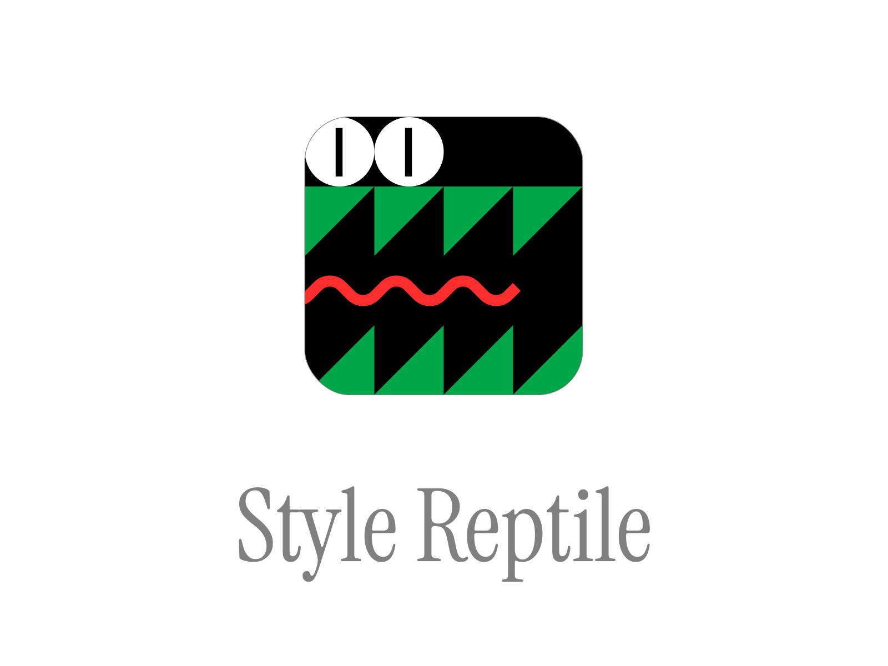
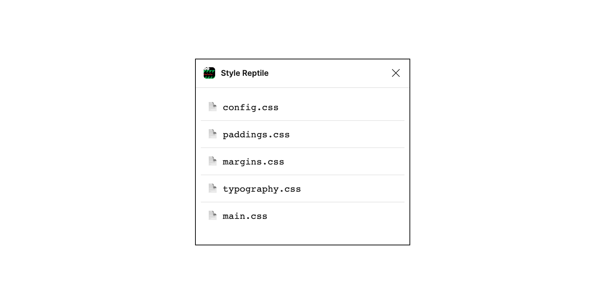
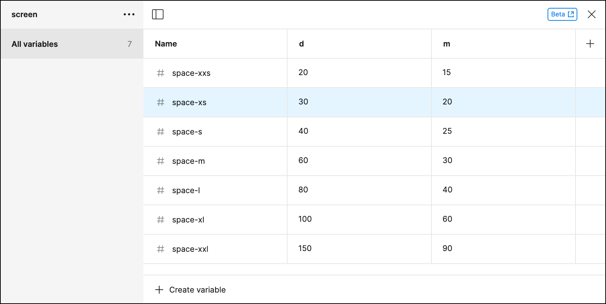
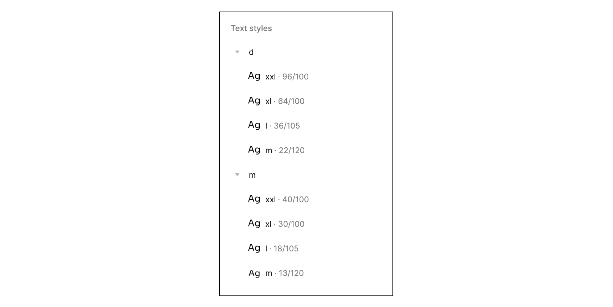

# Style Reptile: Figma to CSS Extractor



This plugin generates CSS styles from Figma styles and variables in adaptive way: using mobile (`m`) and desktop (`d`) values:

- [Spaces](#spaces)
- [Typography](#typography)



## Spaces

### Input

1. Create a collection named `screen`
2. Create a 2 modes in it: `m` for mobile values and `d` for desktop values
3. Add spacing variables prefixed with `space-` of 'Number' type to use as CSS variables in the generation output



4. Run the plugin

### Output

As an output the following will be generated:

1. Root variables in the `config.css` file:

```css
:root {
  --space-xxl: 9rem; /* 1rem = 10px to convenient conversion */
  --space-xl: 6rem;
  --space-l: 4rem;
  --space-m: 3rem;
  --space-s: 2.5rem;
  --space-xs: 2rem;
  --space-xxs: 1.5rem;
}

@media (min-width: 640px) {
  :root {
    --space-xxl: 15rem;
    --space-xl: 10rem;
    --space-l: 8rem;
    --space-m: 6rem;
    --space-s: 4rem;
    --space-xs: 3rem;
    --space-xxs: 2rem;
  }
}
```

2. Paddings and margins classnames in `paddings.css` and `margins.css`:

```css
/* All */

.p-xxl {
  padding: var(--space-xxl);
}
.p-xl {
  padding: var(--space-xl);
}
/* ... */

/* X */

.px-xxl {
  padding-left: var(--space-xxl);
  padding-right: var(--space-xxl);
}
/* ... */

/* Top */

.pt-xxl {
  padding-top: var(--space-xxl);
}
/* ... and so on */
```

- `p-*` / `m-*` — padding / margin all
- `px-*` / `mx-*` — padding / margin left and right
- `py-*` / `my-*` — padding / margin top and bottom
- `pt-*` / `mt-*` — padding / margin top
- `pr-*` / `mr-*` — padding / margin right
- `pb-*` / `mb-*` — padding / margin bottom
- `pl-*` / `ml-*` — padding / margin left

## Typography

### Input

1. Name the text styles by following the pattern `m/*` for mobile and `d/*` for desktop



2. Run the plugin

### Output

As an output the following will be generated:

1. Root variables in the `config.css` file:

```css
:root {
  --text-xxl: normal 400 4rem/1 'Inter';
  --text-xl: normal 400 3rem/1 'Inter';
  --text-l: normal 400 1.8rem/1.05 'Inter';
  --text-m: normal 400 1.3rem/1.2 'Inter';
}

@media (min-width: 640px) {
  :root {
    --text-xxl: normal 400 9.6rem/1 'Inter';
    --text-xl: normal 400 6.4rem/1 'Inter';
    --text-l: normal 400 3.6rem/1.05 'Inter';
    --text-m: normal 400 2.2rem/1.2 'Inter';
  }
}
```

2. Text-style classnames in `typography.css`:

```css
.text-xxl {
  font: var(--text-xxl);
}
.text-xl {
  font: var(--text-xl);
}
.text-l {
  font: var(--text-l);
}
.text-m {
  font: var(--text-m);
}
```
